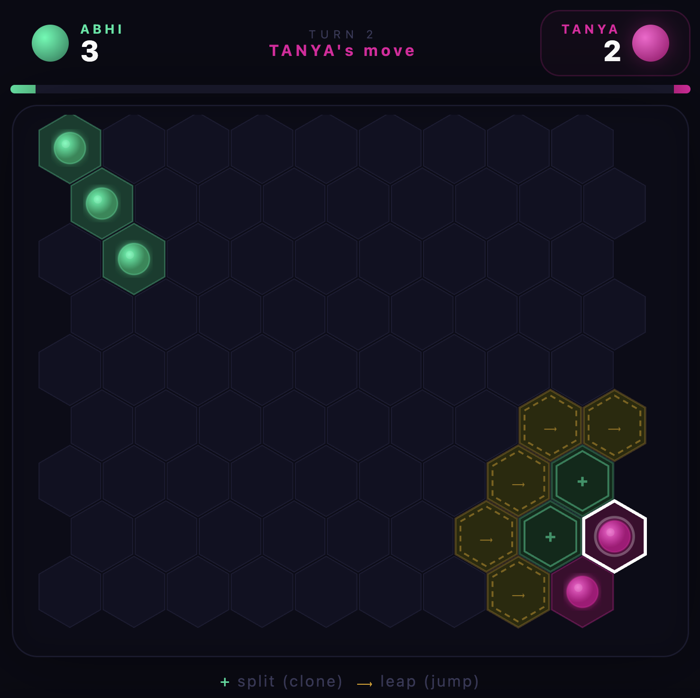

# 🟢🔵 OVERGROW

**A two-player hex territory game where every move spreads, converts, and conquers.**

Overgrow is a fast, strategic board game played on a hexagonal grid. Two players take turns growing their cells across the board — splitting to clone, leaping to jump, and converting enemy neighbors on every landing. One well-placed move can flip half the board. Most territory when the board fills up wins.

Simple to learn. Impossible to put down.

🌐 **[Play it live → overgrow.opxia.ai](https://overgrow.opxia.ai)**

<p align="center">
  
</p>

---

## 🎮 How to Play

### Setup
- Two players share one device (hot-seat multiplayer)
- Each player starts with **2 cells** in opposite corners of a 9×9 hex grid
- Enter your names on the menu screen and hit **Play**

### On Your Turn

**1. Tap one of your cells** to select it. Valid moves light up on the board.

**2. Choose your move:**

| Move | How | What Happens |
|------|-----|--------------|
| **Split** (+) | Move to an **adjacent** hex (1 space) | Your cell **clones** — original stays, copy appears |
| **Leap** (⟶) | Jump to a hex **2 spaces** away | Your cell **moves** there (no clone left behind) |

**3. Convert:** After you land, **all adjacent enemy cells instantly flip to your color.**

> 💡 **Split** grows your count by 1 but moves short. **Leap** doesn't grow you but reaches further — and can land deep in enemy territory for massive conversions.

### Winning

The game ends when **neither player can move** (usually when the board is full). The player controlling **more cells wins**.

If one player loses all their cells, the other wins immediately by elimination.

### Tips & Strategy

- **Splits are safe.** They always grow your count by at least 1.
- **Leaps are risky.** You don't clone, so you need to convert enough enemies to make it worth it.
- **Edges and corners** are defensive — fewer neighbors means fewer ways to get converted.
- **Chain reactions don't exist** — only cells adjacent to your landing spot flip. Plan your positioning.
- **The mid-game swing** is real. A single leap into a cluster of 5-6 enemy cells will flip the entire scoreboard.

---

## 🚀 Quick Start

### Prerequisites

- [Node.js](https://nodejs.org/) (v18 or higher)
- npm (comes with Node.js)

### Run Locally

```bash
# Clone the repo
git clone https://github.com/YOUR_USERNAME/overgrow.git
cd overgrow

# Install dependencies
npm install

# Start dev server
npm run dev
```

Open [http://localhost:5173](http://localhost:5173) in your browser. That's it.

### Build for Production

```bash
npm run build
```

The production-ready files will be in the `dist/` folder.

### Preview Production Build

```bash
npm run preview
```

---

## 🌍 Deploy

Overgrow is a fully static app — no backend. Run `npm run build` and host the `dist/` folder anywhere: Vercel, Netlify, Cloudflare Pages, GitHub Pages, or any static file server.

---

## 📁 Project Structure

```
overgrow/
├── public/
│   ├── favicon.svg
│   └── overgrow.png
├── src/
│   ├── App.jsx          # Main game component
│   ├── main.jsx         # Entry point
│   └── index.css        # Global styles
├── index.html
├── package.json
├── vite.config.js
├── LICENSE
└── README.md
```

---

## 🛠 Tech Stack

- **React 18** — UI rendering
- **Vite** — Build tool and dev server
- **Pure CSS** — No UI framework, fully custom design
- **Zero backend** — Entirely client-side, no server needed

No external game libraries. No canvas. The entire board is rendered as SVG with React state management.

---

## 🤝 Contributing

Contributions are welcome! Some ideas for what you could add:

- **Online multiplayer** via WebSockets
- **AI opponent** with difficulty levels
- **Board size options** (7×7 quick match, 11×11 epic mode)
- **Move history** and replay system
- **Sound effects** and haptic feedback
- **Elo rating system** for competitive play
- **Mobile app** (React Native port)
- **Colorblind mode** with pattern-based pieces
- **Tournament mode** (best of 3/5)

### How to Contribute

1. Fork the repository
2. Create your feature branch (`git checkout -b feature/amazing-feature`)
3. Commit your changes (`git commit -m 'Add amazing feature'`)
4. Push to the branch (`git push origin feature/amazing-feature`)
5. Open a Pull Request

---

## 📜 License

This project is licensed under the **MIT License** — see the [LICENSE](LICENSE) file for details.

You're free to use, modify, and distribute this game. Attribution appreciated but not required.

---

## 🙏 Credits

- Game concept and original implementation built with [Claude](https://claude.ai) by Anthropic
- Hex grid math based on [Amit Patel's hex guide](https://www.redblobgames.com/grids/hexagons/)

---

<p align="center">
  <b>OVERGROW</b><br/>
  <i>Grow. Convert. Dominate.</i><br/><br/>
  If you enjoy the game, give it a ⭐ on GitHub!
</p>
